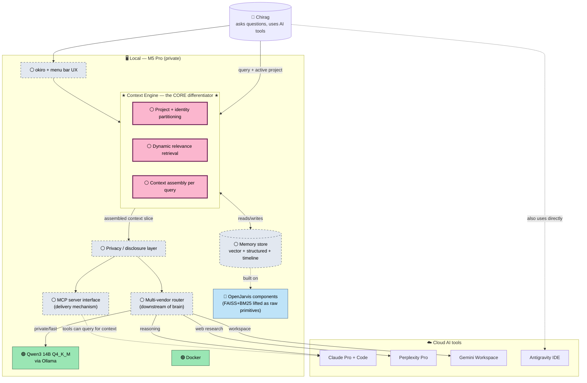

# kage — Architecture & Project Status

> ⚠️ **SUPERSEDED — Session-1 legacy (2026-05-21).** The Mermaid diagram and "Fork OpenJarvis" / FAISS / Antigravity framing below are **OUTDATED** (they predate the Odysseus swap #81 and 13 sessions of decisions). **Current truth:** [blueprint.md](blueprint.md) §4 (architecture; Odysseus substrate, own-vs-donated layers) + [cycle-1-pitch.md](cycle-1-pitch.md) (v0.1). New diagrams use ASCII, not Mermaid.
>
> **Living document.** Updated every session as scope/status changes.
>
> **Status legend:** 🟢 done · 🟡 in progress · ⚪ planned · 🔵 exploring · ❓ undecided

*Last updated: 2026-05-21 (Session 1 — planning)*

---

## Current focus

**🔵 Discovery / planning** — we are here. No code yet. Refining what kage is, what to build, in what order.

---

## System map (v0.1 — context engine at center)

> **Corrected 2026-05-21:** kage's core is **context management**, not multi-vendor routing. The Context Engine (project-partitioned, identity-aware, dynamic retrieval) is the brain. Everything else is downstream infrastructure.

> **❓ Missing components flagged by Chirag (TBD):** to be added next session.

---

## What's decided

| Decision | Resolution | When | Where to read more |
|---|---|---|---|
| Local model | Qwen3 14B Q4_K_M via Ollama | Pre-session | CLAUDE.md |
| Sandbox | Docker (already installed) | Pre-session | CLAUDE.md |
| Cloud fallback | Claude Sonnet 4.6 | Pre-session | CLAUDE.md |
| Identity framing | kage = local context broker + multi-vendor router (not "another assistant") | Session 1, 2026-05-21 | this file |
| Repo strategy | Fork OpenJarvis on GitHub as `kage`, stay close to upstream | Session 1 | memory: project-openjarvis-relationship |
| SDLC starter pack | Shape Up cycles · GitHub Flow · ADRs · Conventional Commits · README/ROADMAP/CHANGELOG · GitHub Actions CI · pre-commit · semver | Session 1 | memory: project-dual-goal-learn-sdlc |
| Visual tracker | Mermaid in this file (`docs/architecture.md`), updated session-to-session | Session 1 | this file |
| Dual goal | Ship kage AND learn industry SDLC by mimicking real-team practice | Session 1 | memory: project-dual-goal-learn-sdlc |

## What's still open (brainstorm dimensions — reordered by criticality)

| Dimension | Status | Leading direction |
|---|---|---|
| **★ Context engine design** (project partitioning + dynamic retrieval) | ⚪ **highest priority — next up** | The differentiator. Needs careful design before Cycle 1. |
| **★ Memory shape & storage** (closely coupled to context engine) | ⚪ **highest priority — next up** | Vector + structured + project tags. FAISS+BM25 from OJ as primitives. |
| Privacy / selective-disclosure mechanics | 🔵 surface only | Per-identity allowlists + redaction. Emerges from context engine. |
| Identity / account routing | 🔵 surface only | Hybrid (auto-detect + explicit override) |
| Interaction model (how kage talks to other tools) | 🔵 partial | MCP server primary + hotkey + dossier files |
| Multi-model routing logic | 🔵 secondary | Downstream consumer of context engine output |
| Learning model | 🟡 proposal made | T1 prompt-only · explicit+implicit · per-identity. Pending discussion. |
| Voice / interface modality | ⚪ queued | TBD |
| Proactivity (reactive vs. ambient) | ⚪ queued | TBD |
| Device topology | 🔵 surface only | Single-device v1; hub+thin-client future |

## Session log (high-level)

- **Session 1 (2026-05-21)** — Planning. Audited OpenJarvis (verified Stanford SAIL provenance, 8 agents not 6, far more complete than notes assumed). Reframed kage from "personal AI" to "personal context broker." Locked dual goal (ship + learn SDLC). Adopted SDLC starter pack. Created this file.

---

## Next session resume point

> **Continue widening dimension 6 (learning model).** Then dimensions 7-9. Then collapse everything into a Discovery Doc and write Cycle 1 pitch.

